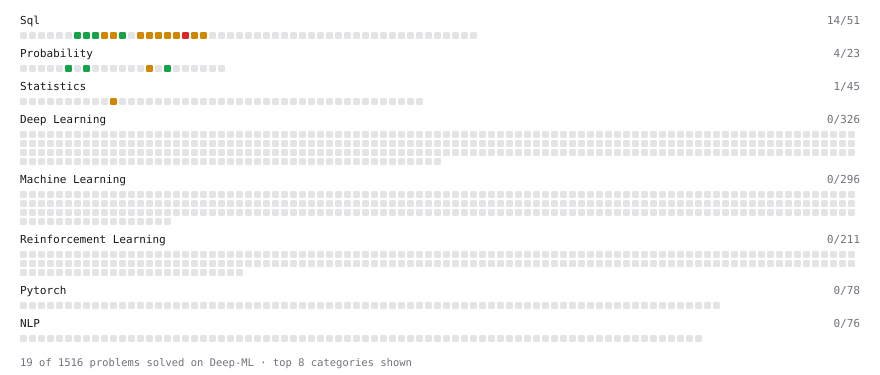

# Deep-ML

My machine learning practice from [Deep-ML](https://www.deep-ml.com). Every solution here was written by hand.

**29** solved · 27 problems · 0 labs · 2 math

[**Browse the interactive portfolio**](https://Ipshita04.github.io/deep-ml/) to replay this filling in over time.

## Problems

| | Difficulty | Solved | |
| --- | --- | --- | --- |
| [Average per group](https://www.deep-ml.com/problems/1108) | easy | 2026-10-02 | [solution](problems/1108-average-per-group) |
| [Calculate Conditional Probability from Data](https://www.deep-ml.com/problems/168) | easy | 2026-10-01 | [solution](problems/0168-calculate-conditional-probability-from-data) |
| [Compute Posterior Probability using Bayes' Theorem](https://www.deep-ml.com/problems/336) | easy | 2026-09-28 | [solution](problems/0336-compute-posterior-probability-using-bayes-theorem) |
| [Count rows per group](https://www.deep-ml.com/problems/1107) | easy | 2026-10-02 | [solution](problems/1107-count-rows-per-group) |
| [Delete Duplicate Emails Keeping One](https://www.deep-ml.com/problems/1112) | easy | 2026-10-03 | [solution](problems/1112-delete-duplicate-emails-keeping-one) |
| [Expected Value and Variance of an n-Sided Die](https://www.deep-ml.com/problems/179) | easy | 2026-09-29 | [solution](problems/0179-expected-value-and-variance-of-an-n-sided-die) |
| [Handle Missing Data in pandas (dropna/fillna)](https://www.deep-ml.com/problems/1128) | easy | 2026-10-07 | [solution](problems/1128-handle-missing-data-in-pandas-dropna-fillna) |
| [Your first JOIN](https://www.deep-ml.com/problems/1109) | easy | 2026-10-02 | [solution](problems/1109-your-first-join) |
| [Birthday Problem Probability](https://www.deep-ml.com/problems/246) | medium | 2026-10-01 | [solution](problems/0246-birthday-problem-probability) |
| [Days Warmer Than the Previous Day](https://www.deep-ml.com/problems/1118) | medium | 2026-10-04 | [solution](problems/1118-days-warmer-than-the-previous-day) |
| [Each Customer's Lowest-Priced Order](https://www.deep-ml.com/problems/1122) | medium | 2026-10-06 | [solution](problems/1122-each-customer-s-lowest-priced-order) |
| [Employees Earning Above Their Department Average (Correlated Subquery)](https://www.deep-ml.com/problems/1126) | medium | 2026-10-06 | [solution](problems/1126-employees-earning-above-their-department-average-correlated-subquery) |
| [Employees Earning More Than Their Managers](https://www.deep-ml.com/problems/1113) | medium | 2026-10-06 | [solution](problems/1113-employees-earning-more-than-their-managers) |
| [Filter, Group, and Aggregate a DataFrame (Top-10 by Metric)](https://www.deep-ml.com/problems/1127) | medium | 2026-10-07 | [solution](problems/1127-filter-group-and-aggregate-a-dataframe-top-10-by-metric) |
| [Highest Total Daily Order Cost in a Date Range](https://www.deep-ml.com/problems/1120) | medium | 2026-10-05 | [solution](problems/1120-highest-total-daily-order-cost-in-a-date-range) |
| [Highest-Paid Workers with Title Join and Ties](https://www.deep-ml.com/problems/1121) | medium | 2026-10-06 | [solution](problems/1121-highest-paid-workers-with-title-join-and-ties) |
| [Maximum Likelihood Estimation for Gaussian Distribution](https://www.deep-ml.com/problems/337) | medium | 2026-09-28 | [solution](problems/0337-maximum-likelihood-estimation-for-gaussian-distribution) |
| [Merge Multiple DataFrames](https://www.deep-ml.com/problems/1129) | medium | 2026-10-08 | [solution](problems/1129-merge-multiple-dataframes) |
| [Month-over-Month Percentage Change with LAG](https://www.deep-ml.com/problems/1115) | medium | 2026-10-04 | [solution](problems/1115-month-over-month-percentage-change-with-lag) |
| [Nth-Highest Salary with Ties and NULL](https://www.deep-ml.com/problems/1110) | medium | 2026-10-02 | [solution](problems/1110-nth-highest-salary-with-ties-and-null) |
| [Rank Rows Within Partitions Using Window Functions](https://www.deep-ml.com/problems/1114) | medium | 2026-10-03 | [solution](problems/1114-rank-rows-within-partitions-using-window-functions) |
| [Running Total and Moving Average with Window Frames](https://www.deep-ml.com/problems/1116) | medium | 2026-10-04 | [solution](problems/1116-running-total-and-moving-average-with-window-frames) |
| [Top-3 Salaries Per Department](https://www.deep-ml.com/problems/1111) | medium | 2026-10-03 | [solution](problems/1111-top-3-salaries-per-department) |
| [Top-N Most Profitable Companies with DENSE_RANK](https://www.deep-ml.com/problems/1123) | medium | 2026-10-06 | [solution](problems/1123-top-n-most-profitable-companies-with-dense-rank) |
| [Top-N Percent by Group with NTILE](https://www.deep-ml.com/problems/1125) | medium | 2026-10-06 | [solution](problems/1125-top-n-percent-by-group-with-ntile) |
| [Values Appearing Three or More Times Consecutively](https://www.deep-ml.com/problems/1117) | medium | 2026-10-05 | [solution](problems/1117-values-appearing-three-or-more-times-consecutively) |
| [Cohort Retention: First Login and Consecutive-Day Logins](https://www.deep-ml.com/problems/1119) | hard | 2026-10-05 | [solution](problems/1119-cohort-retention-first-login-and-consecutive-day-logins) |

## Math

| | Difficulty | Solved | |
| --- | --- | --- | --- |
| [Bayes' Theorem](https://www.deep-ml.com/math-problems/20) | medium | 2026-09-28 | [solution](math/0020-bayes-theorem) |
| [Bayesian Methods](https://www.deep-ml.com/math-problems/28) | hard | 2026-09-28 | [solution](math/0028-bayesian-methods) |

---

_This file is regenerated by Deep-ML on every push._
